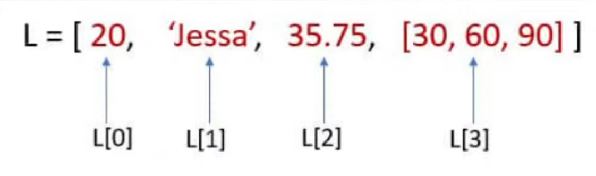

"""
What are Lists?
Lists Vs Arrays
Characterstics of a List
How to create a list
Access items from a List
Editing items in a List
Deleting items from a List
Operations on Lists
Functions on Lists
"""
# List is a data type where we can store multiple items under 1 name. More technically, lists act like dynamic arrays which means you can add more items on the fly.
